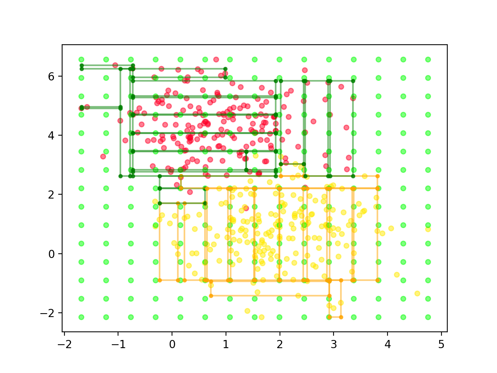
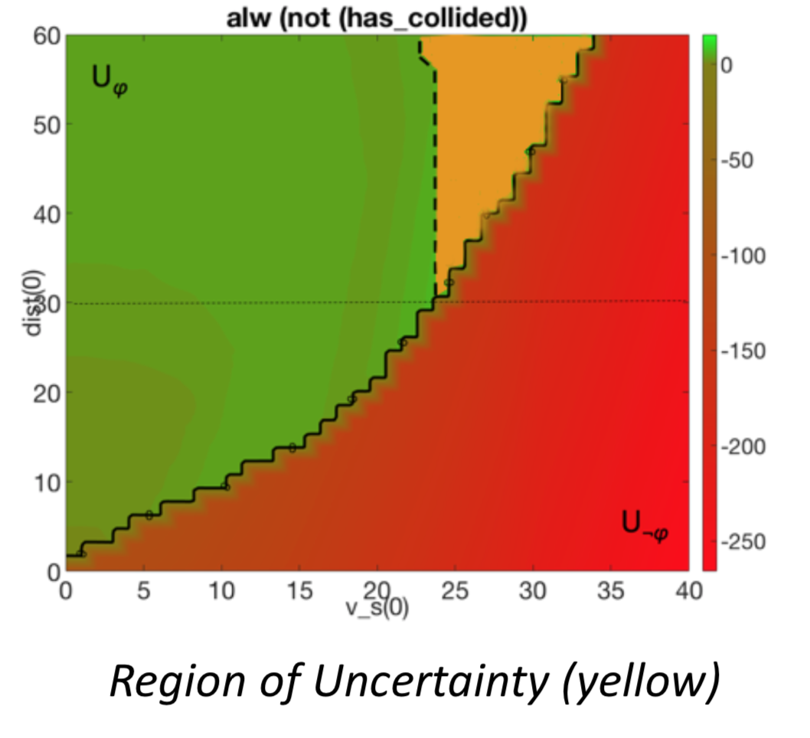

#Safe  Machine Learning 

## ML Component Aspect 

* Interpretable Models

  * **Advantage**: 
    * **Easier for formal verfication (reachability analysis)? ** (for rule/dt) The input space is naturally partitioned and the output space is relative small ( or can be made linear)
    * Not black box, deterministc ,easy to debug
  * **Disadvantage** The performance is not comparable to deep neural network, and can only  handle easy task.
  * **Guess ** :   
    * Can we use Interpretable Models to bound the output of dnn for ease of verfication
  * (From verifying AV paper) Level of ML usage ： an end to-end use of ML not be encouraged.
    -  it is unclear what the “tells” are for a machine exhibiting safe behavior vs. getting lucky with unsafe behavior.  Being able to reasonably infer causality of actions from explicit system information can reduce testing costs compared to a brute force statistical approach.

* **Model Explanation -> Locally interpretable models**
  * **basic idea**:  In the vicinity of an instance, the decision boundary of a classifier can be interpretable locally.
  * **achors**: The anchors (a set of rules) can also compute the coverage of the local model for approximating the black box models
  * **Wild Guess **: the idea of  coverage for anchors is interesting. The anchors only approximate the black model based on sampling around the instance.  In practice, the coverage of a model should be based on both the data density and the accuracy of the local models.  
  * **Question**:  How to apply explain regression models?

* Feature Extract:  compute the global importance of each feature in the model by either removing the features that are not of interest or the switch the values of features from different samples.

* Reject Option:  Use reject option to avoid  low-confidence prediction.  

  * **Advantage**: 

    - Observiously,   it can avoid unsafe action.
    - **Guess**:    can it be used to make the verfication more easier **if** we can identify confident region and unconfident.   However, the confident region is not 100 percent confident

  * **Problem**

    *  How it can be directly applied.   Any application scenario (of course, for decision sciene, it can be directly applied)?   What action to take  if an rejection happens.
    * How to measure the confidence level of a prediction.  
      * Existing approach  train multiple models and study the variance. (But is it  always true if low vairance means confident)
      * For ensemble models, based on votes  (is it  always true ?  data point from the empty space is not such case)
    * How to indentify confident region and unconfident, how to measure confidence level?

  * **Wild Guess** :  we can partition the empty space with the data by sampling the empty space

    

     

* Rarity  : Rare class/ rare classes could cause small disjuncts where most errors occurs.  Most existing works do not favor rare class while error of rare objects could cause more severe problems.

  * Reasons:

    - Evaluation metric accuracy does not favor rarity
    - Difficult to generate regularities/decision boundary for rare cases.
    - Difficult to distinguish between real rare cases or noisy
    - The general bias is not suitable for rarity.

  * ##### Potential Strategies

    - Detect the small disjuncts and more powerful method for small disjuncts.

    - Learn only the Rare Class:

    - Increase the cost of rare objects

    - Over sample (over fit) and under sample (loss of information) 

* **(But we still  know the state of art,  and whether the mentioned techniques have  already been applied.)**.

## Verifying ML using formal methods

* The **high dimension original data** was extracted to **low-dimension feature vector** so that the region of uncertain  can be found, and  counter examples can be found from the uncertain region 

  * * **Reason**: Formal methods can not handle high dimension large input space and  complicated models ( the approximate algorithm it use is  **interpolation**)

    

  * **Problem**  

    * Need to find **good representation of  the origin data**  so that most  information is still kept, and the simplified  function can approximate the original model.
      * Why not to use the approximated model  directly?
    * **Essence**:  It use a simper model with few features for verification hoping that the  simple model can approximate the black box model.  
    * **More complicated Abstraction**
      * A hierarchicaly model instead of end-to-end model.  A low level model can extract the feature distance between cars, pedestrains.  A high level simple model predict and take actions. 
      *  It is difficult abstact features for more complicated tasks.

* Reachability analysis+Neural network: 

  * The space of input  is partitioned and for each partition of input space, the upper and lower bound of the output is then computed for that layer.
  * **Guess**  Instead, can we use a more simple model to bound the output for each input space partition？   For example:  for an DNN, all its output for a input space is bounded by a simple linear model or  decsion tree based model (used as a safety envelope?). 

## Verifying AV Process

- ##### Characteristics of ML that can impact safety or safety assessment

  - Non-transparency
  - Error rate
  - **Training-based** ：Training sets used in place of a safety requirement specification，
  - Instability: difficult to debug models or reuse parts of previous safety assessments.

  

- Controllability and Observability

  Controllability is the ability of a tester to control the initial state and the workload executed by a system under test. Observability is the ability of the tester to observe the state of the system to determine whether a test passed or failed.

  
* Level of ML usage ： an end to-end use of ML not be encouraged.

  

* Passing Tests for the Right Reason: Interpretability

  For HAV, it is unclear what the “tells” are for a machine exhibiting safe behavior vs. getting lucky with unsafe behavior. Being able to reasonably infer causality of actions from explicit system information can reduce testing costs compared to a brute force statistical approach. 

  