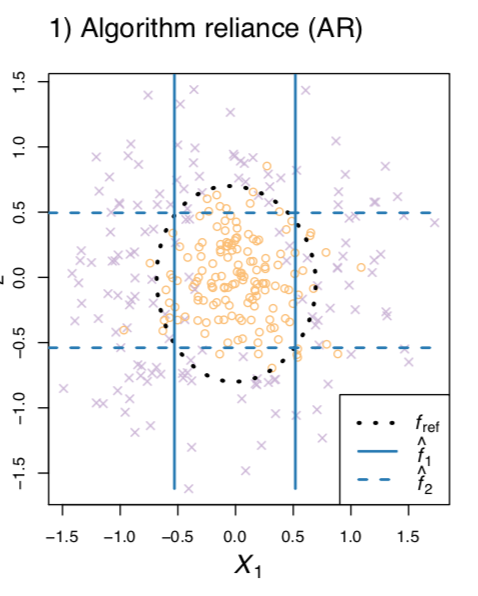
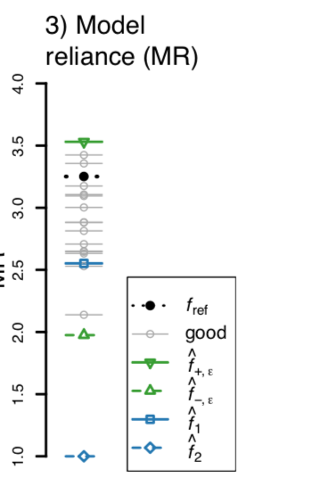
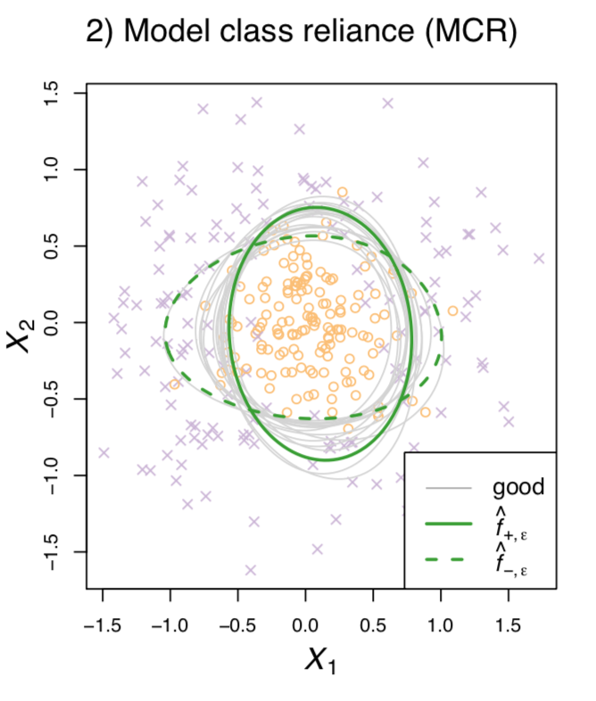

###Notations 

- $Y\in \mathcal Y $: outcome variable
- $X=(X_1,X_2)$ two subsets of covariate varibles
  - Study how much different model depend on $X_1$ to predict $Y$
- $Z=(Y,X_1,X_2)\in \mathcal Z$
- data set $\mathbf Z=\left[\mathbf y^{n\times 1}, \mathbf X^{n\times p}\right]$
- $Z$ is iid 
- Model Class $\mathcal F\subset \{f|f:\mathcal X\rightarrow \mathcal Y\}$
  - $f(x)$ or $f(x_1,x_2)$ as  a prediction model
- Loss function $L$
  - Squared Error Loss $L(f,z)=(y-f(x))^2$
- Algorithm :  $\mathcal A: \mathcal Z^n\rightarrow \mathcal F$ :   $f=A(\mathbf Z)$

###Alogorithm Reliance （Existing Metic）

Algorithm （model-fitting algorithm） reliance  (AR) on $X_1$:  

* run a model-fitting algorithm A twice, 
  * first on all of the data,
  *  and then again after removing $X_1$ from the dataset .
* The losses for the two resulting models are then compared to determine the importance, or “necessity,” of $X_1$ 

####AR property

* This measure is a function of ~~two prediction models rather than one,~~
  * it does not measure how much either individual model relies on X1.

* AR  can result in seemingly incoherent behavior. Specifically, if several prediction models fit the data well, then removing a variable may not substantially change the prediction loss even if **the best prediction model relies heavily on that variable.**
  *  can identify the strongest performing prediction model with no reliance on a given variable, but they generally do not bound how much any well-performing model may rely on that variable. 

### MR :   Model  Reliance 

How much a model, a model-fitting algorithm, or a model class, relies on a subset of covariates $X_1$. 

$X=[X_1: (height), X_2: (age)]$,   $x^a=(1.6,21),x^b=(1.8,22)$

* 'Switched Loss' ：  be the loss of model $f$ on $z^{(b)}$, if $x_1^{(b)}$ was first replaced with $x_1^{(a)}$:  
  * Like anchors? fixed some feature and permutate

$$
  h_f(z^a,z^b):=L(f,(y^b,x_1^{(a)},x_2^{(b)}))\\
  e_{switch}(f):=\mathbb E h_f(Z^{(a)},Z^{(b)})\\
  \hat e_{switch}(f):=\frac{1}{(n-1)(n)}\sum_{i=1}^n\sum_{j\neq i} h_f(\mathbf Z_{[i,:]},\mathbf Z_{[j,:]})
  \\=\frac{1}{(n-1)(n)}\sum_{i=1}^n\sum_{j\neq i} L(f, (\mathbf y_{[i]},\mathbf X_{1[i,:]},\mathbf X_{2[j,:]}))
$$

* 'Original Loss '  i.e, the standard loss
  $$
  e_{orig}(f):=\mathbb E h_f(Z^{(a)},Z^{(a)})\\
  \hat e_{orig}(f):= \frac{1}{n}\sum_{i=1}^n L(f,\mathbf Z_{[i,:]})=\hat {\mathbb E} L(f,Z)
  $$

* Model Reliance :  the ratio of switched  loss  and original loos

$$
MR(f)=:\frac{e_{switch}(f)}{e_{orig}(f)}\\
\hat MR(f)=:\frac{\hat e_{switch}(f)}{\hat e_{orig}(f)}
$$

#### Model  Reliance and Causal Effects 

##### Causal Inferene Literature

$$
\mbox{Rename: }  (Y,X_1,X_2)\Rightarrow (Y,T,C)\\
T:X_1 \mbox{ represents a binary treatment indicator {0,1}}\\
C:X_2\mbox{  a set of baseline covariates}\\
f^*(t,c)=\mathbb E(Y|C=c,T=t)\\
$$

* $Y_1,Y_0$:  potential outcomes under treatment and control respectively 

  * $Y = Y_0(1 − T ) + Y_1T . $
    * i.e,  if $T=0$, $Y=Y_0$, if $T=1$, $Y=Y_1$

* Treatment Effect:  $Y_1-Y_0$

*  Average treatment effect :   $\mathbb E [Y_1-Y_0]$

* Conditional average treatment effect :  
  $$
  \mathcal T \mathcal E(c):\mathbb E[Y_1-Y_0|C=c]=\mathbb E[Y_1|C=c,T=1]-\mathbb E[Y_0|C=c,T=0]=f^*(t=1,c)-f^*(t=0,c)
  $$

* $P(T=1|C=c)\in (0,1)$

##### Relation between  $\mathcal T \mathcal E(c)$ and the model reliance  $e_{orig}(f^{*})-e_{switch}(f^*)$ 

suppose the loss function is $L(f,(y,t,c)):=(y-f(t,c))^2$

##### Relation

$$
e_{orig}(f^{*})-e_{switch}(f^*)=\mbox{Var}(T)\sum_{t\in\{0,1\}} \mathbb E_{C|T=t}\mathcal T \mathcal E(C)^2
$$

##### Model reliance for linear models  

For any prediction model $f$ and squared error loss  , and $f_{\beta}(x)=X_1^T\beta_1+X_2^T\beta_2$

then, 
$$
e_{switch}(f)-e_{orig}(f)=2Cov(Y,X_1)\beta_1-2\beta_2^TCov(X_2,X_1)\beta_1
$$

*  Model reliance for linear models can be interpreted in terms of the **population covariances and the model coefficients**. 

#### Model Class Reliance

$$
\mbox{ subset of good models: }\mathcal R(\epsilon, f^*,\mathcal F):=\{f\in \mathcal F: e_{orig}(f)\leq e_{orig}(f^*)+\epsilon\}
$$

$$
MCR_{+}(\epsilon, f^*,\mathcal F):=\max_{f\in \mathcal R(\epsilon, f^*,\mathcal F):} MR(f)\\
MCR_{-}(\epsilon, f^*,\mathcal F):=\min_{f\in \mathcal R (\epsilon, f^*,\mathcal F):} MR(f)\\
$$

* if $MCR_{+}$ is  low, no well performing model exists that places high importance on $X_1$ 
* if $MCR_{-}$   is large, then every well performing model must rely substantially on $X_1$ 
* In practice, we need to use $f_{ref}$ to approximate the optimal $f^*$

##### Finite-sample bounds for model class reliance 

Assumptions :

* Bounded individual loss 
  $$
  f\in \mathcal F: L(f_{ref},(y,x_1,x_2)\leq B_{ind}
  $$

* Bounded relative loss)

  
  $$
  | L(f,(y,x_1,x_2)- L(f_{ref},(y,x_1,x_2)|\leq B_{ref}
  $$

* Bounded average loss)
  $$
  \mathbb P(0\leq b_{avg}\leq \hat{e}_{orig}(f)\leq B_{avg})=1
  $$

Suppose $f_{+,\epsilon}=\in \arg\max_{\mathcal R(\epsilon)} MR(f)$ and $f_{-,\epsilon}=\in \arg\min_{\mathcal R(\epsilon)} MR(f)$ satisfy the above assumptions,   then
$$
\mathbb P(MCR_{+}(\epsilon)>\widehat {MCR}_+(\epsilon_1)+\mathcal Q_1)\leq \delta\\
\mathbb P(MCR_{-}(\epsilon)<\widehat {MCR}_-(\epsilon_1)-\mathcal Q_1)\leq \delta\\
\epsilon_1:=\epsilon+2 B_{ref}\sqrt{\frac{\log(3\delta^{-1})}{2n}}\\
\mathcal Q_1:=\frac{B_{avg}}{b_{avg}}-\frac{B_{avg}-B_{ind}\sqrt{\frac{\log(3\delta^{-1})}{n}}}{b_{avg}+B_{i nd}\sqrt{\frac{\log(3\delta^{-1})}{2n}}}
$$

##### r-margin-expection-cover : a function set  $\mathcal G_r$:  if for any $f\in \mathcal F$, and distribution D, there exists a $g\in \mathcal G_r$ such taht 

$$
\mathbb E_{Z\sim D}|L(f,Z)-L(g,Z)|\leq r\\
\mathcal N(\mathcal F, r):  \mbox{covering number: the size of smallest  } \mathcal G_R
$$

$$
\mathbb P(MCR_{+}(\epsilon)<\widehat {MCR}_+(\epsilon_3)+\mathcal Q_3)\leq \delta\\
\mathbb P(MCR_{-}(\epsilon)>\widehat {MCR}_-(\epsilon_3)-\mathcal Q_3)\leq \delta\\
\epsilon_3=\epsilon-2B_{ref}\sqrt{   \frac{\log(4\delta^{-1}\mathcal N(\mathcal F,r\sqrt 2))}{n}   }-2r\\
\mathcal Q_3:=\frac{B_{avg}}{b_{avg}}-\frac{B_{avg}   -B_{ind}\sqrt{\log(8\delta^{-1}\mathcal N(\mathcal F,r\sqrt 2) /n} -2r\sqrt 2}{b_{avg}+B_{ind}\sqrt {\log(8\delta^{-1}\mathcal N(\mathcal F,r)/2n}  -2r}
$$

### Illustrations 

* $X=(X_1,X_2)\in \mathbb R^2$  and $Y\in\{-1,1\}$

* $\mathbb E[X_1|Y=-1]=\mathbb E[X_2|Y=-1]=0$,  $\mathbb V(X_1|Y=-1)=\mathbb V(X_2|Y=-1)=1/9$

*  For $Y=1$, $X$ are drawn as $Y=-1$, but additional $(\cos (U, \sin(U))$ are added

* $\mathcal F$ : 3-degree  polynomial classifers
  $$
  f_{\theta}(x_1,x_2)=\theta_1+\theta_2x_1...\theta_4x_1^2+\theta_5 x_2^2+\theta_6x_1x_2...\theta_{10}x_1x_2^2
  $$

### MR

The classifier $\hat f_2$ fit without using $X_1$ (blue dashed line) has a model reliance=1

- $\mathbf v$ : vector
  - $\mathbf v_{[j]}$: the jth element of $\mathbf v$
  - $\mathbf v_{[-j]}$ : all elements except the jth
- $\mathbf A$ : matrix
  - $\mathbf A^T$ : TRANSPOSE

$e_{switch}(f)​$ : expected loss in a pair of observations in which **the treatment has been switched**?.
$$
{e_{orig}(f)}=\mathbb E(L(f,y,T,C))=p(t=1) \int \int L(f,y,t=1,c)g(y,c|t=1)d_yd_c+p(t=0) \int \int L(f,y,t=0,c)g(y,c|t=0)d_yd_c\\
e_{switch}(f)=p(t=1)\int \int L(f,y,t=0,c)g(y,c|t=1) d_yd_c+\\p(t=0)\int \int L(f,y,t=1,c)g(y,c|t=0) d_yd_c\\
e_{switch}(f^*)-e_{orig}(f^{*})=p(t=1) \int \int  [ (y-\mathbb E[y|0,c])^2-(y-\mathbb E[y|1,c])^2]g(y,c|t=1)d_yd_c\\+
(1-p(t=1))\int \int  [ (y-\mathbb E[y|1,c])^2-(y-\mathbb E[y|0,c])^2]g(y,c|t=0) d_yd_c\\
$$

$$
\mbox{ subset of good models: }\mathcal R(\epsilon, f^*,\mathcal F):=\{f\in \mathcal F: e_{orig}(f)\leq e_{orig}(f^*)+\epsilon\}
$$

$$
\mathcal T \mathcal E(C):\mathbb E[Y_1-Y_0|C=c]=\mathbb E[Y_1|C=c,T=1]-\mathbb E[Y_0|C=c,T=0]=f^*(T=1,C)-f^*(T=0,C)\\
$$

$$
\sum_{t\in\{0,1\}} \mathbb E_{C|T=t}\mathcal T \mathcal E(C)^2=\int\int (\mathbb E[y|1,c]-\mathbb E[y|0,c])^2 g(y,c|1)d_yd_c+\int\int (\mathbb E[y|1,c]-\mathbb E[y|0,c])^2 g(y,c|0)d_yd_c\\
\mbox{Var}(T)=\mathbb E [(T-p(t=1))^2]=p(t=1)(1-p(t=1))
$$
