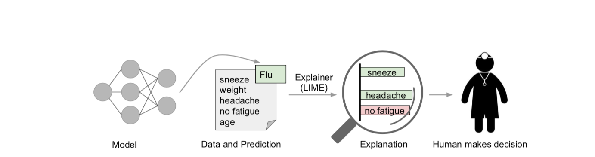
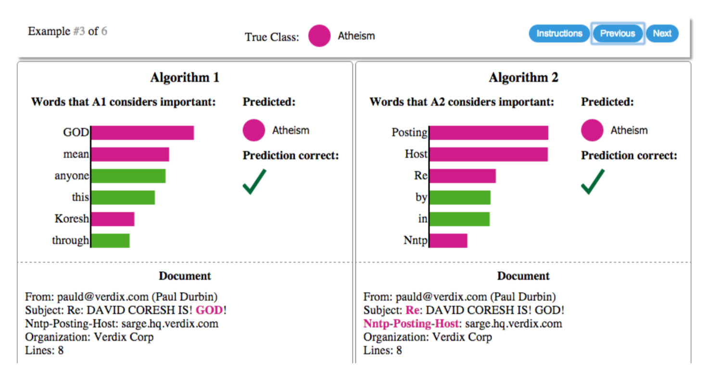
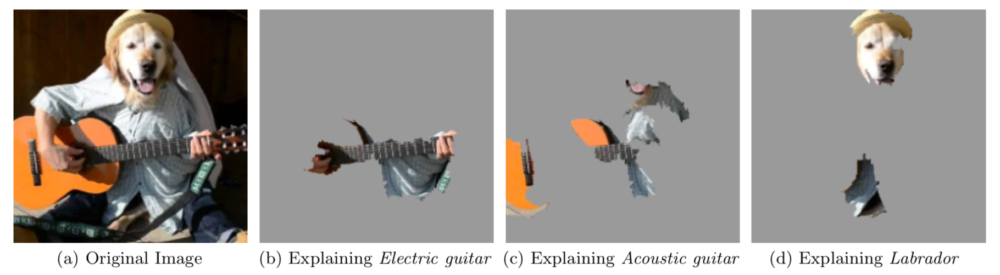
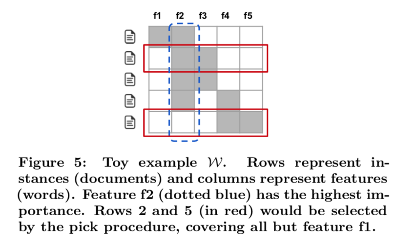

##Explaining the Predictions of Any Classifier 

###Motivation:

Problem of Held-Out Evaluation of Overall Trust in  Model: this strategy may not correspond to performance “in the wild”  

If the users do not trust a model or a prediction, they will not use it.  

1. trusting a prediction, i.e. whether a user trusts an individual prediction sufficiently to take some action based on it, and 
2.  trusting a model, i.e. whether the user trusts a model to behave in reasonable ways if deployed. 

#### Prediction explanation ?

Present textual or visual artifacts that provide qualitative understanding of the relationship between the instance’s components (e.g. words in text, patches in an image) and the model’s prediction 

Humans usually have prior knowledge about the application domain, which they can use to accept (trust) or reject a prediction if they understand the reasoning behind it.  

#### Model Explanantion helps Model Selection

Machine learning practitioners often have to select a model from a number of alternatives, requiring them to assess the relative trust between two or more models. 

**green** :  for  “Christianity”

**magenta**:  for “Atheism”

#### Desired Characteristics for Explainers 

Provide **qualitative understanding** between the **input variables** and the **response. **

####Interpretability must take into account the user’s limitations.

If  **hundreds or thousands of features significantly contribute to a prediction**, it is not reasonable to expect any user to **comprehend why the prediction was made**, even if individual weights can be inspected. 

####local fidelity. 

For an explanation to be meaningful,  it must at least be **locally faithful**, i.e. it must correspond to how the model behaves in the **vicinity of the instance being predicted** 

* what features lead the model makes such a prediction around the instance?
* features that are **globally important** may not be important in the **local context**, and vice versa 

### Local Explanation 

#### Interpretable Data Representations 

Suppose $x \in \mathbb  R^d $ be the original representation of an instance

Let $x'\in \{0,1\}^{d'}$  be **a binary vector for its interpretable representation** 

-  for text, it is a list of words indicating the **presence or absence of a word,** 
-  for image classification ,  it is  binary vector indicating the “presence” or “absence” of **a contiguous patch of similar pixels (a super-pixel),**

Figure 4b in particular provides insight as to why acoustic guitar was predicted to be electric: due to the fretboard.  

#### Local interpretable models 

Let define an **explanation as a model**  $g \in G$, where G is a class of potentially interpretable models, such as **linear models**, **decision trees**, or **falling rule lists** 

* Complexity of g : $\Omega(g)$  (as opposed to interpretability) 

  * E.g.,  decision tree,  $\Omega(g)=|H|$ depth of the tree or number of leaf nodes 

* Original Black Model :  $f:\mathbb R^d\rightarrow \mathbb R$

  * For binary classification,  $f(x)$ is the probability x belongs to a certain class

* Locality around x:  

  * $\pi_x(z)$  as proximity measure between an instance z to x 

* $\mathcal L(f,g,\pi_x)$:  a measure of how unfaithful g is in approximating f  in the locality 

*   Produce explanation :
   $$
   \xi(x)=\arg \min_{g\in G}\mathcal L(f,g,\pi_x)+\Omega(g)\\
   $$
   

#### Sparse Linear Explanations (text mining) 

$$
g(z')=w_g^T.z'\\
\mbox{Proximity measure-exponential kernel :          }\pi_x(z)=\exp\left(  -D(x,z)^2/\sigma^2 \right)\\
\mathcal L(f,g,\pi_x)=\sum_{z,z'\in \mathcal Z} \pi_x(z)(f(z)-g(z'))^2\\
\Omega(g)=\infty.\mathbb I(||w_g||>K): \mbox{ K is a limit of the number of words}\\
$$

* Image classification:  using “super-pixels” (computed using any standard algorithm) instead of words

#### Sampling instances around x′  uniformly   (x' is already determined)  

$$
x=('apple','food','bag....')\\
x'=[x_1=1,x_2=1,x_3=1,x_4=0]\\
$$

* Drawing **nonzero elements of x′ uniformly** at random,  $z'=(1,1,0,0)/ (1,0,10)$ **contains a fraction of the nonzero elements of x′ **
* The number of such draws is also uniformly sampled=n=(1,3)

###SUBMODULAR PICK FOR EXPLAINING MODELS

Explanations of multiple instances can be insightful,  these **instances need to be selected judiciously**, since users may not have the time to examine a large number of explanations. 

*  Budget B :    time/patience that humans have, i.e., the number of instances humans to check

*  Given the explanations for a set of instances X (|X| = n), we construct an n × d′ explanation matrix W    that represents the local importance of the interpretable components for each instance. 
  $$
  W_{i,j}=|w_{gi,j}|\mbox{ weigt of the ith instance of feature j}\\
  I_j=\sqrt{\sum_i W_{i,j}}: \mbox{ column j, the global importance of jth feature}
  $$

##### Key:    Avoid selecting instances with similar explanations. 

After the second row is picked, the third row adds no value, as the user has already seen features f2 and f3 - while the last row exposes the user to completely new features. 

##### Maximize coverage

$$
c(V,W,I)=\sum_{j=1} ^{d'}=\mathbb I[ \exist  i\in V: W_{i,j}>0] I_j\\
V=V\cup \arg\max c(V\cup i,W,I)\\ \mbox{ we want to introduce new features or feature with the maximum increased global importance.}
$$

## Anchors

* Rule $A(x)=1$ if x satisfy rule A

*  A is an Anchor  if 
  $$
  Prec(A)=\mathbb E_{P(z|A)}[\mathbb I_{f(x)=f(z)}]\geq \pi ,~A(z)=1
  $$

* coverage $cov(A)=\mathbb E_{P(z|A)} [A(z)]$

* Objective

$$
\max cov(A)\\
P(prec(A)\geq \pi)\geq 1-\sigma
$$

#### Description

* $\mathcal A=\{A\}$, and add rule $a_i$  (an addiction feature predicate) to $\mathcal A$  if $cov(A\wedge a_i)>c$
  * $\mathcal A\leftarrow \mathcal A\cup(A\wedge a_i)$
* estimate $prec,prec_{ub},prec_{lb}$ for $forall A\in \mathcal A$
  * $A\leftarrow \arg \max_{A} prec(A)$
  * $A'\leftarrow \arg\max_{A'} prec_{ub}(A')$
* Loop until $prec_{ub}(A')-prec_{lb}(A)>\sigma$
  * sample z z' according $P(z|A)$ and  $P(z'|A')$ and update prec(A)

