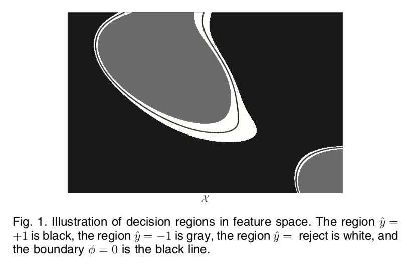
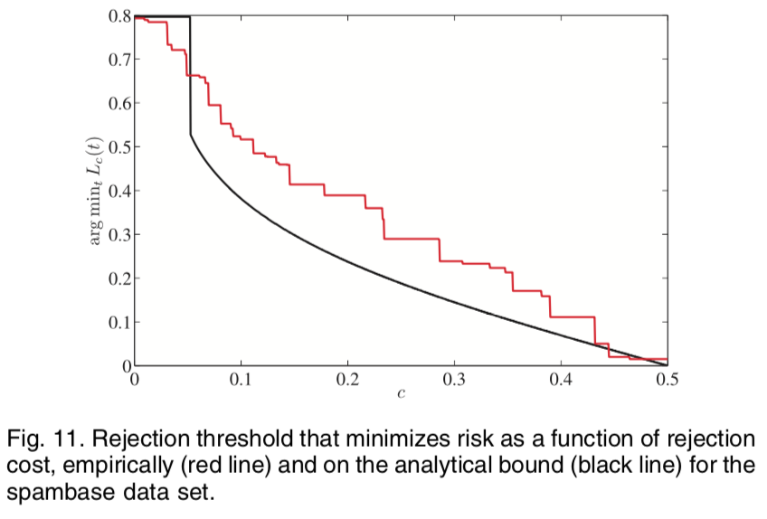
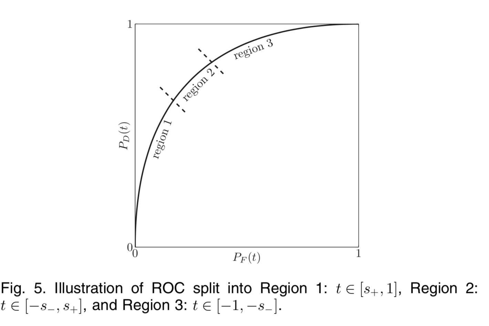

## Practical Ensemble Classification Error Bounds for Different Operating Points 

###  PROBLEM SETUP 

1.  Supervised binary classification  $y\in \{-1,1\},~\mathbb x\in \mathcal X$
2. Ensemble classification:  $\phi(\mathbb x)=\frac{1}{m}\sum_i^m\hat y_i(\mathbb x)\in[-1,1]$
3. $\hat y(\mathbb x)=\begin{cases}-1~\mbox{ if  }\phi(\mathbb x)\leq 0\\1~\mbox{ if  }\phi(\mathbb x)>0\end{cases}$

####Classification with a Reject Option

$$
\hat y(\mathbb x)=\begin{cases}-1~\mbox{ if  }\phi(\mathbb x)\leq t\\\mbox{reject, if }\phi(\mathbb x)\in(-t,t)\\1~\mbox{ if  }\phi(\mathbb x)\geq t\end{cases}
$$

* rejection, provides a guard band around the decision region 

  

* margin z measures the extent to which the average number of votes  for the right class exceeds the average vote for any other class.  
  $$
  z=mr(\mathbb x,y)= av_k I(\hat y_k(\mathbb x)=y)−\max_{ j ≠Y} av_k I(\hat y_k(\mathbb x)= j)
  $$

  * Error Probability:  $P_E(t) = P_{X,Y} (mg(x,y) < -t) $
    * if  y=1   $mg(x,y)=av_1-av_{-1}=\phi(x)<-t$
    * if y=-1  $mg(x,y)=av_{-1}-av_1=-\phi(x)\\ \phi(x)>t\Rightarrow z<-t$
  * Rejection Prabability $P_R(t)=\mbox{Pr}[z\in(-t,t)]$

  

* measure of performance ：reject option risk 
  $$
  L_c(t)=\underbrace{P_E(t)}_{\mbox{Cost of misclassification} }+\underbrace{cP_R(t)}_{\mbox{cost of rejection is c}}\\
  $$

* Classication Error:

  * False Alarm :   False Positive (FP)  $\hat y=+1\wedge y=-1$
    $$
    P_F(t)=\mbox{Pr}[\phi>  t|y=-1]=\int_{t}^1 f(\phi|y=-1)d\phi
    $$

  * Missed dectection : False Negative  (FN)  $\hat y=-1\wedge y=+1$

    * $$
      P_M(t)=\mbox{Pr}[\phi\leq t|y=+1]=\int_{-1}^t f(\phi|y=+1)d\phi
      $$

      

* The dectection probability : the percentage of alarms can be detected
  $$
  P_D(t)=\mbox{Pr}[\phi>t|y=+1]=\int_{t}^1 f(\phi|y=+1)d\phi
  $$

####  

###BOUNDS BASED ON STRENGTH AND CORRELATION 

*  correlation: 
  $$
  \bar p=\frac{2}{m(m-1)}  \sum_{i\neq j} \mathbb E [\hat y_i(\mathbb x) \hat y_j(\mathbb x)]
  $$

* strength :  $s=\mathbb E[z]$

From [8] the random forest paper, it is true that
$$
\mbox{var}(z)=\mathbb E[(z-s)^2]\leq\bar p(1-s^2)
$$
Suppse s>0, better than randomly predict, than the following bound on generalization error is derived in [8] using the Chebyshev inequality, 
$$
\mbox{Pr}(y\neq \hat y(x))\leq \frac{\bar p(1-s^2)}{s^2}
$$

#### Chebyshev Inequality 

Let X be a random variable for which Var(X) exists, then for every t>0, 
$$
\mbox{Pr}(|X-\mathbb E[X]|>t)\leq \frac{\mbox{Var(X)}}{t^2}
$$

####Bound for Reject Option Risk   

Based on the Cantelli (one-sided Chebyshev) inequality  

* $P_E(t)\leq \frac{1}{1+\frac{(s+t)^2}{\bar p(1-s^2)}},s>-t$
* $\mbox{Pr}[z<t]\leq \frac{1}{1+\frac{(s-t)^2}{\bar p(1-s^2)}},s>t$

$$
L_c(t)=P_E(t)+cP_R(t)=\mbox{Pr}[z\leq -t]+c\mbox{Pr}[-t \leq z<t]\\
= (1-c)\mbox{Pr}[z\leq -t]+c\mbox{Pr}[z<t]\\
=(1-c) P_E(t)+c\mbox{Pr}[z<t]\\
\leq\frac{1-c}{1+\frac{(s+t)^2}{\bar p(1-s^2)}}+ \frac{c}{1+\frac{(s-t)^2}{\bar p(1-s^2)}},~s>t
$$

####Bound for Receiver Operating Characteristic 

##### Conditional correlation 

* $\bar p_+=\frac{2}{m(m-1)}  \sum_{i\neq j} \mathbb E [\hat y_i(\mathbb x) \hat y_j(\mathbb x)|y=+1]​$

* $\bar p_-=\frac{2}{m(m-1)}  \sum_{i\neq j} \mathbb E [\hat y_i(\mathbb x) \hat y_j(\mathbb x)|y=-1]$

#####Conditional  strength

* $s_+=\mathbb E[\phi|y=+1]$
* $s_-=-\mathbb E[\phi|y=-1]$
* $s=s_+ \mbox{Pr}[y=1]+s_-\mbox{Pr}[y=-1]$

The  bound for dectection probability : the percentage of alarms can be detected, 

$$
P_D(t)=\mbox{Pr}[\phi>t|y=+1]\leq  \frac{1}{1+\frac{(s_+-t)^2}{\bar p_+(1-s_+^2)}}, s_+<t\\
P_D(t)\geq  \frac{1}{1+\frac{\bar p_+(1-s_+^2)}{(s_+-t)^2}}, s_+>t
$$
False alarm bound:
$$
P_F(t)\leq   \frac{1}{1+\frac{(s_--t)^2}{\bar p_-(1-s_-^2)}}, -s_-<t\\
P_F(t)\geq  \frac{1}{1+\frac{\bar p_-(1-s_-^2)}{(s_--t)^2}}, -s_->t
$$

##### The implicit bound 

If $t\in [-s_-, s_+], $,  we have $P_D(t)\geq  \frac{1}{1+\frac{\bar p_+(1-s_+^2)}{(s_+-t)^2}},$ and $P_F(t)\leq   \frac{1}{1+\frac{(s_--t)^2}{\bar p_-(1-s_-^2)}}$

* if $t=-s_-$,   $P_F\leq 1$ 
* if $t=s_+$, $P_D>0$

For small false alarm probability,  $\bar p_-$􏰃􏰀􏰆 should be small and $s_-$􏰆 should be large. For large detection probability, 􏰃􏰀$\bar p_+$ should be small and $s_+$ should be large.  

$$
P_D\geq \begin{cases}0~\mbox{ if  }P_F\leq \frac{\eta_F}{\eta_F+1}\\\frac{1}{1+\eta_m\left( 1-\sqrt{\eta_F(P_F^{-1}-1)}\right)^{-2}}~\mbox{ if  }P_F>\frac{\eta_F}{\eta_F+1}\end{cases}\\
\eta_m=\frac{\bar p_+(1-s_+^2)}{(s_+s_-)^2}\\
\eta_F=\frac{\bar p_-(1-s_-^2)}{(s_+s_-)^2}
$$
 To push the ROC up in the low missed detection regime, we would like 􏰄$\eta_m$ to be as close to zero as possible. 