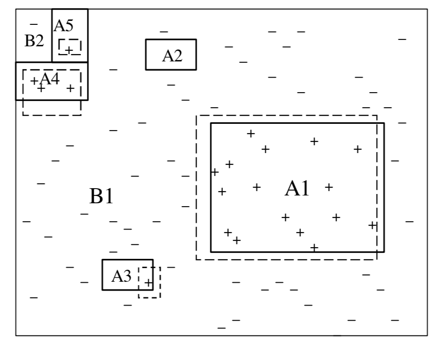
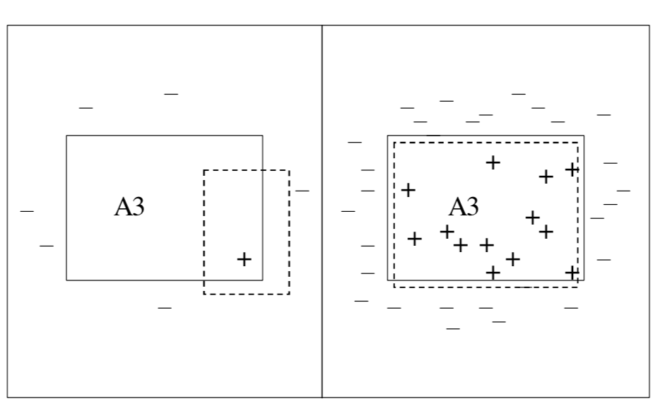
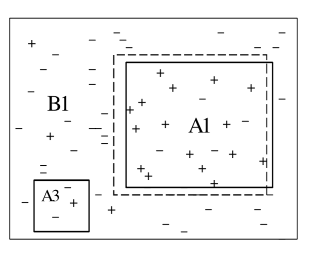

## Mining with Rarity: The role that rare classes and rare cases  

* Rare classes :  for classification problems, the harzard events are much fewer than normal event 
* Rare cases. : a  meaningful small region of the instance space (within-class imbalances) 
  * If the task is to identify the presence of cancer using blood test results, a rare case may correspond to those test indicators that are associated with a rare form of cancer 

* Absolute  rarity  

* Relative   rarity  

  If a case or class covers 1% of a dataset that has one thousand entries, we would certainly say that the class/case is rare—but what if the dataset contains ten million entries?  

###WHY DOES RARITY MAKE DATA   MINING DIFFICULT 

####Improper Evaluation Metrics 

* Existing **evaluation metric** does **not** adequately value **rarity**

  * E.g., information gian in decison tree $\sum_i - p_i\log p_i $
* Rare class have less impact on classificcation accuracy
  * Positive:Negative = 99999:1 
* Minority has much lower   (than major class)
  * Precision:  TP/(TP+FP)
  * Recall:   TP/P

####Lack of Data: Absolute Rarity 

It  is  difficult to detect regularities within the rare classes/cases. 

Rare cases cause small disjuncts in the learned classifier  generally have a much higher error rate than large disjuncts.

* ​	One explanation is that some **small disjuncts may not represent rare, or exceptional, cases**, but rather something else—such as **noisy data**. 
* Only   **“meaningful small disjuncts”** should be kept. 
  * **Statistical significance testing** .- Disjuncts that cover few examples will not pass these significance tests.  (but significance for small disjuncts cannot reliably estimated )

#### Relative Lack of Data: Relative Rarity 

The common objects may obscure the true signal.

Detect the association between **food processor and cooking pan**. 

* both items are rarely purchased in a supermarket, 
* so that even if the two are often purchased together when either one is purchased, this association may not be found. 
* the minimum support threshold for the algorithm must be set quite low. However, if this were done, it would cause a combinatorial explosion.

#### Data Fragmentation 

* Many algorithms employ a **divide-and-conquer approach**, where instance space being partitioned into smaller and smaller pieces .
* Regularities can then only be found within each individual partition, which will contain less data 

#### Inappropriate Inductive Bias 

Generalizing from specific examples, or induction, requires an extra-evidentiary bias.   Many learners util- ize a **general bias** in order to foster generalization and avoid over-fitting. 

* Decision Tree/Naive Bayse : predict the  the most frequent class 

This bias can adversely **impact the ability to learn rare cases and rare classes. **

####  Noise 

###METHODS FOR ADDRESSING RARITY 

####More Appropriate Evaluation Metrics 

* The most common is ROC  
* AUC : Area Under ROC Curve
*  Precision and recall 
* F-measure 
  * F1 Measure:  $F_1=\frac{2 Pre\times Recall}{Pre+Recall}$

**Rare cases and classes** are valued when using these metrics because both precision and recall are defined with respect to the positive (rare) class 

* Taking the class distribution into account.    One would expect disjuncts that predict the majority class to have a lower error rate than those predicting the minority class 
  * Rather than using the entire training set to estimate the class priors, a more representative (local) set of examples is used. This set only uses training examples that are "close" to the small disjunct—that is, fail to satisfy at most one condition in the disjunct.  

####Non-Greedy Search Techniques 

Rare objects are not easily located using greedy search (decision tree max entropy gain) heuristics.  Rare objects may depend on the conjunction of many conditions and therefore examining any single condition in isolation may not provide much information, or guidance. 

* Genetic algorithms (cope well with attribute interactions  and avoid getting stuck in local maxima)
* Brute  performs an exhaustive depth-bounded search for accurate conjunctive rules 

#### Using a More Appropriate Inductive Bias 

Most algorithm favors generality over specialization.   A  general bias is good for common cases, it is not appropriate for rare cases and may even cause rare cases to be totally ignored.  

* Rather than using  maximum generality bias for all disjuncts, **more specific biases were evaluated for the induced small disjuncts**.  
* First first use C4.5 a decision-tree learner, to determine if an example is covered by a small or large disjunct
  *  If the example was covered by a large disjunct, then C4.5 was used to classify the example; 
  * otherwise an instance-based (nearest neighbour) learner was used to classify the example. 
* For small disjuncts exmaples are fed into genetic algorithms based learner

####  Learn only the Rare Class 

If we try to learn a set of classification rules for all classes, the rare classes may be largely ignored. One solution to this problem is to only learn classification rules that predict the rare class. 

-  Brute: Focus on performance of rules that predict rare class
-  Ripper:  iteratively build rules to cover previously uncovered training examples. Each rule is grown by adding conditions until no negative examples are covered. 

####Segmenting the Data 

Imagine that some target event is rare, only occurring .001% of the time. It may be that by segmenting the data into two regions, R1 and R2, this target event may occur 20% of the time in R1 and .0001% of the time in R2. One can then mine R1 with- out the problems associated with extremely rare classes. While it will be even more difficult to mine R2 for the target events, this may be acceptable, since R1 may contain the majority of these events. 

####  Accounting for Rare Items 

Specifying multiple minimum levels of support to reflect the frequencies of the associated items in the distribution.  Specifically, the user can specify a **different minimum support for each item**. 

####  Cost-Sensitive Learning 

Assigning a greater cost to false negatives than to false positives will improve performance with respect to the positive (rare) class.   If this misclassification cost ratio is 3:1, then a region that has ten negative examples and four positive examples will nonetheless be labeled with the positive class.  

#### Sampling 

The basic idea is to eliminate or minimize rarity by **altering the distribution of training examples**. 

* Under-sampling eliminates **majority-class** examples
  * Discard  **potentially useful** majority-class examples and thus can degrade classifier performance 
* only removes majority-class examples **that are redundant** with other examples or border regions with minority-class examples.
* Over-sampling, in its simplest form, **duplicates minority-class examples**. 
  * increase the time necessary to build a classifier. 
  * Overfit
* adding examples from the line segments that join the k minority-class nearest neighbors 

* Identify a good class distribution and sampling the training set with the desired class distribution（10% 20%…）

* Progressive sampling:  the ratio of positive to negative examples added in each iteration based on the performance of class distributions in the previous iteration

  

#### Others 

##### Boosting

Boosting algorithms, such as AdaBoost, are iterative algorithms that **place different weights on the training distribution each iteration**. After each iteration boosting **increases the weights associated with the incorrectly classified examples and decreases the weights associated with the correctly classified examples.** This forces the learner to focus more on the incorrectly classified examples in the next iteration 

##### Rare Cases as Separate Classes

1. clustering each classes  into subclasses
2. relabelling the training examples 
3. relearning the training set

####  